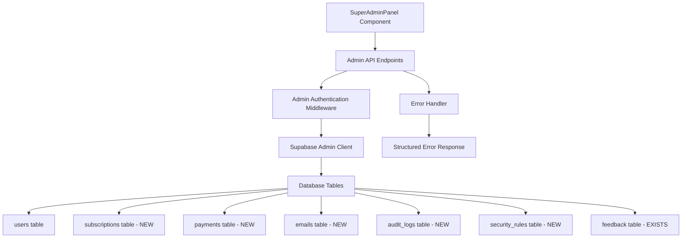

# Design Document

## Overview

This design addresses the critical data connectivity issues in the SuperAdminPanel component where all dashboard statistics show zeros instead of real data. The root cause is missing database tables, incomplete migrations, and configuration issues with Supabase service role authentication.

The solution involves creating missing database tables, implementing proper admin authentication, fixing API endpoints to return real data, and adding comprehensive error handling.

## Architecture

### Current Architecture Issues
- **Missing Tables**: subscriptions, payments, emails, audit_logs, security_rules tables don't exist
- **Authentication Gap**: Service role key not configured for admin queries
- **RLS Blocking**: Row Level Security policies block admin queries without proper bypass
- **Silent Failures**: API endpoints return zeros instead of error messages when queries fail
- **Mixed Database Access**: Some queries use Supabase client, others use direct PostgreSQL

### Proposed Architecture


## Components and Interfaces

### 1. Database Schema Extensions

#### New Tables to Create

**subscriptions table**
```sql
CREATE TABLE subscriptions (
  id UUID PRIMARY KEY DEFAULT gen_random_uuid(),
  user_id UUID REFERENCES auth.users(id) ON DELETE CASCADE,
  stripe_subscription_id TEXT UNIQUE,
  plan_name TEXT NOT NULL,
  status TEXT NOT NULL CHECK (status IN ('active', 'canceled', 'past_due', 'unpaid', 'trialing')),
  current_period_start TIMESTAMPTZ,
  current_period_end TIMESTAMPTZ,
  cancel_at_period_end BOOLEAN DEFAULT false,
  created_at TIMESTAMPTZ DEFAULT NOW(),
  updated_at TIMESTAMPTZ DEFAULT NOW()
);
```

**payments table**
```sql
CREATE TABLE payments (
  id UUID PRIMARY KEY DEFAULT gen_random_uuid(),
  user_id UUID REFERENCES auth.users(id) ON DELETE SET NULL,
  subscription_id UUID REFERENCES subscriptions(id) ON DELETE SET NULL,
  stripe_payment_intent_id TEXT UNIQUE,
  amount_cents INTEGER NOT NULL,
  currency TEXT NOT NULL DEFAULT 'usd',
  status TEXT NOT NULL CHECK (status IN ('succeeded', 'pending', 'failed', 'canceled')),
  payment_method TEXT,
  created_at TIMESTAMPTZ DEFAULT NOW()
);
```

**emails table**
```sql
CREATE TABLE emails (
  id UUID PRIMARY KEY DEFAULT gen_random_uuid(),
  user_id UUID REFERENCES auth.users(id) ON DELETE SET NULL,
  recipient_email TEXT NOT NULL,
  subject TEXT NOT NULL,
  template_name TEXT,
  status TEXT NOT NULL CHECK (status IN ('sent', 'delivered', 'bounced', 'failed')),
  provider TEXT DEFAULT 'aws_ses',
  sent_at TIMESTAMPTZ DEFAULT NOW(),
  delivered_at TIMESTAMPTZ,
  opened_at TIMESTAMPTZ,
  clicked_at TIMESTAMPTZ
);
```

**audit_logs table**
```sql
CREATE TABLE audit_logs (
  id UUID PRIMARY KEY DEFAULT gen_random_uuid(),
  user_id UUID REFERENCES auth.users(id) ON DELETE SET NULL,
  action TEXT NOT NULL,
  resource_type TEXT,
  resource_id TEXT,
  details JSONB,
  ip_address INET,
  user_agent TEXT,
  level TEXT NOT NULL CHECK (level IN ('info', 'warning', 'error')) DEFAULT 'info',
  created_at TIMESTAMPTZ DEFAULT NOW()
);
```

**security_rules table**
```sql
CREATE TABLE security_rules (
  id UUID PRIMARY KEY DEFAULT gen_random_uuid(),
  type TEXT NOT NULL CHECK (type IN ('ip_block', 'rate_limit', 'access_rule')),
  value TEXT NOT NULL,
  reason TEXT NOT NULL,
  active BOOLEAN DEFAULT true,
  created_by UUID REFERENCES auth.users(id) ON DELETE SET NULL,
  created_at TIMESTAMPTZ DEFAULT NOW(),
  expires_at TIMESTAMPTZ
);
```

### 2. Admin Authentication Service

#### Supabase Admin Client Configuration
```typescript
interface AdminClientConfig {
  serviceRoleKey: string;
  projectUrl: string;
}

class AdminAuthService {
  private adminClient: SupabaseClient;
  
  constructor(config: AdminClientConfig) {
    this.adminClient = createClient(config.projectUrl, config.serviceRoleKey, {
      auth: { persistSession: false }
    });
  }
  
  async verifyAdminUser(email: string, token: string): Promise<boolean>;
  async bypassRLS(): Promise<SupabaseClient>;
}
```

#### Admin Middleware
```typescript
interface AdminContext {
  user: AdminUser;
  adminClient: SupabaseClient;
}

async function adminAuthMiddleware(c: Context): Promise<AdminContext | Response>;
```

### 3. Enhanced API Endpoints

#### Dashboard Statistics Endpoint
```typescript
interface DashboardStats {
  totalUsers: number;
  activeSubscriptions: number;
  monthlyRevenue: number;
  errorCount: number;
  activeTrials: number;
  emailsSent: number;
  lastUpdated: string;
}

// GET /api/admin/stats
async function getAdminStats(adminClient: SupabaseClient): Promise<DashboardStats>;
```

#### User Management Endpoints
```typescript
interface UserManagementAPI {
  // GET /api/admin/users
  getUsers(filters?: UserFilters): Promise<UserRecord[]>;
  
  // POST /api/admin/users/:id/block
  blockUser(userId: string, reason: string): Promise<void>;
  
  // POST /api/admin/users/:id/role
  updateUserRole(userId: string, role: string): Promise<void>;
}
```

#### Billing Management Endpoints
```typescript
interface BillingAPI {
  // GET /api/admin/subscriptions
  getSubscriptions(filters?: SubscriptionFilters): Promise<Subscription[]>;
  
  // GET /api/admin/payments
  getPayments(dateRange?: DateRange): Promise<Payment[]>;
  
  // GET /api/admin/revenue
  getRevenueStats(period: 'month' | 'quarter' | 'year'): Promise<RevenueStats>;
}
```

### 4. Error Handling System

#### Structured Error Response
```typescript
interface AdminAPIError {
  success: false;
  error: string;
  code: string;
  details?: any;
  timestamp: string;
}

interface AdminAPISuccess<T> {
  success: true;
  data: T;
  timestamp: string;
}

type AdminAPIResponse<T> = AdminAPISuccess<T> | AdminAPIError;
```

#### Error Categories
- `CONFIG_ERROR`: Missing environment variables
- `AUTH_ERROR`: Authentication/authorization failures  
- `DATABASE_ERROR`: Database connection or query failures
- `VALIDATION_ERROR`: Invalid input parameters
- `NOT_FOUND_ERROR`: Requested resource doesn't exist

## Data Models

### Enhanced User Model
```typescript
interface AdminUserRecord extends UserRecord {
  subscription?: {
    plan: string;
    status: string;
    current_period_end: string;
  };
  payment_history?: Payment[];
  last_activity?: string;
  total_spent?: number;
}
```

### Subscription Model
```typescript
interface Subscription {
  id: string;
  user_id: string;
  stripe_subscription_id: string;
  plan_name: string;
  status: 'active' | 'canceled' | 'past_due' | 'unpaid' | 'trialing';
  current_period_start: string;
  current_period_end: string;
  cancel_at_period_end: boolean;
  created_at: string;
  updated_at: string;
}
```

### Payment Model
```typescript
interface Payment {
  id: string;
  user_id: string;
  subscription_id?: string;
  stripe_payment_intent_id: string;
  amount_cents: number;
  currency: string;
  status: 'succeeded' | 'pending' | 'failed' | 'canceled';
  payment_method?: string;
  created_at: string;
}
```

### Audit Log Model
```typescript
interface AuditLog {
  id: string;
  user_id?: string;
  action: string;
  resource_type?: string;
  resource_id?: string;
  details?: Record<string, any>;
  ip_address?: string;
  user_agent?: string;
  level: 'info' | 'warning' | 'error';
  created_at: string;
}
```

## Correctness Properties

*A property is a characteristic or behavior that should hold true across all valid executions of a system-essentially, a formal statement about what the system should do. Properties serve as the bridge between human-readable specifications and machine-verifiable correctness guarantees.*

### Property Reflection

After analyzing all acceptance criteria, I identified several areas where properties can be consolidated:

- **Database Schema Properties**: Multiple criteria (1.1-1.5) test individual table existence, but these can be combined into comprehensive schema validation properties
- **Admin Authentication Properties**: Criteria 2.1-2.3 all relate to admin authentication and can be consolidated  
- **Dashboard Stats Properties**: Criteria 3.1-3.6 all test that stats return real data instead of zeros - these follow the same pattern
- **Data Management Properties**: Criteria 4.1-4.5, 5.1-5.5, 6.1-6.5, 7.1-7.5, 8.1-8.5, 9.1-9.5 all follow similar patterns for different admin sections
- **Error Handling Properties**: Criteria 10.1-10.5 all relate to proper error handling instead of silent failures

### Core Properties

**Property 1: Database Schema Completeness**
*For any* required admin table (subscriptions, payments, emails, audit_logs, security_rules), the table should exist with proper schema including all required columns, indexes, and constraints after migrations complete
**Validates: Requirements 1.1, 1.2, 1.3, 1.4, 1.5, 1.6**

**Property 2: Admin Authentication Enforcement**  
*For any* admin API endpoint call, the system should verify super admin privileges and use service role key for database queries, returning authentication errors instead of zeros when verification fails
**Validates: Requirements 2.1, 2.2, 2.3**

**Property 3: Dashboard Statistics Accuracy**
*For any* dashboard statistic (users, subscriptions, revenue, errors, trials, emails), the stats endpoint should return actual counts from the corresponding database table, not default zeros
**Validates: Requirements 3.1, 3.2, 3.3, 3.4, 3.5, 3.6**

**Property 4: User Management Data Persistence**
*For any* user management operation (view, search, block, role update), the system should read from and write to the users table correctly, with all changes logged to audit_logs
**Validates: Requirements 4.1, 4.2, 4.3, 4.4, 4.5**

**Property 5: Billing Data Consistency**
*For any* billing operation (view subscriptions, view payments, calculate revenue, update status), the system should use real data from subscriptions and payments tables with accurate calculations
**Validates: Requirements 5.1, 5.2, 5.3, 5.4, 5.5**

**Property 6: Audit Logging Completeness**
*For any* system log operation (view, filter, create), the system should use the audit_logs table with proper pagination and filtering capabilities
**Validates: Requirements 6.1, 6.2, 6.3, 6.4, 6.5**

**Property 7: Email Management Integration**
*For any* email management operation (view records, track delivery, calculate stats, manage templates), the system should use the emails table with accurate tracking data
**Validates: Requirements 7.1, 7.2, 7.3, 7.4, 7.5**

**Property 8: Security Rules Management**
*For any* security rule operation (view, add, delete, modify), the system should use the security_rules table with proper validation and audit logging
**Validates: Requirements 8.1, 8.2, 8.3, 8.4, 8.5**

**Property 9: Database Browser Functionality**
*For any* database browsing operation (list tables, view data, show structure, query with limits), the system should provide accurate information with proper pagination and search capabilities
**Validates: Requirements 9.1, 9.2, 9.3, 9.4, 9.5**

**Property 10: Error Handling Transparency**
*For any* system failure (database connection, missing tables, authentication, configuration, API calls), the system should return specific error messages instead of default zeros or silent failures
**Validates: Requirements 10.1, 10.2, 10.3, 10.4, 10.5**

<function_calls>
<invoke name="prework">
<parameter name="featureName">admin-panel-data-fix

## Error Handling

### Error Classification System
- **CONFIG_ERROR**: Missing environment variables (SUPABASE_SERVICE_ROLE_KEY, DATABASE_URL)
- **AUTH_ERROR**: Authentication/authorization failures, invalid admin privileges
- **DATABASE_ERROR**: Connection failures, missing tables, query errors
- **VALIDATION_ERROR**: Invalid input parameters, malformed requests
- **NOT_FOUND_ERROR**: Requested resources don't exist

### Error Response Format
All admin API endpoints return structured error responses:
```typescript
{
  success: false,
  error: "Human-readable error message",
  code: "ERROR_CODE",
  details: { /* Additional context */ },
  timestamp: "2024-01-01T00:00:00Z"
}
```

### Fallback Behavior
- When Supabase is not configured, return configuration errors instead of mock data
- When tables don't exist, return specific "table not found" errors
- When authentication fails, return 401 with clear error message
- Never return default zeros for failed queries

## Testing Strategy

### Dual Testing Approach
This system requires both unit tests and property-based tests to ensure comprehensive coverage:

**Unit Tests** focus on:
- Specific database schema validation after migrations
- Configuration validation at startup
- Error message formatting and codes
- Individual API endpoint responses
- Authentication middleware behavior

**Property-Based Tests** focus on:
- Universal properties across all admin endpoints (authentication, error handling)
- Data consistency across all CRUD operations
- Statistics accuracy across all dashboard metrics
- Audit logging for all state-changing operations
- Pagination and filtering across all data views

### Property Test Configuration
- **Framework**: Use Jest with fast-check for TypeScript property-based testing
- **Iterations**: Minimum 100 iterations per property test
- **Test Tags**: Each property test references its design document property
  - Format: `**Feature: admin-panel-data-fix, Property {number}: {property_text}**`

### Test Database Setup
- Use separate test database with same schema as production
- Run migrations before each test suite
- Seed test data for property tests
- Clean up after each test to ensure isolation

### Integration Testing
- Test complete admin panel workflows end-to-end
- Verify real database connections work correctly
- Test with actual Supabase service role key
- Validate RLS policy bypass functionality