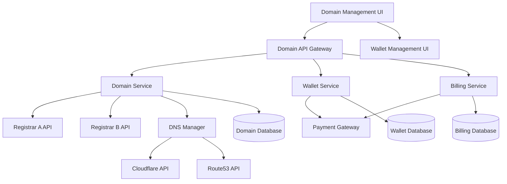

# Design Document: Domain Management System

## Overview

The domain management system provides comprehensive domain search, purchase, and DNS management capabilities integrated with a prepaid wallet system. The architecture supports multiple domain registrars, automatic billing, and a 20% markup revenue model while maintaining separation between subscription and wallet-based services.

## Architecture

### High-Level Architecture



### Service Layer Architecture

The system follows a microservices pattern with clear separation of concerns:

1. **Domain Service**: Handles domain search, registration, and management
2. **Wallet Service**: Manages prepaid credits, auto-recharge, and transactions
3. **Billing Service**: Handles subscription billing separate from wallet
4. **DNS Service**: Manages DNS records and propagation
5. **Pricing Service**: Calculates markup and handles currency conversion

## Components and Interfaces

### Domain Management Components

#### DomainSearchEngine
```typescript
interface DomainSearchEngine {
  searchDomains(query: string, tlds: string[]): Promise<DomainSearchResult[]>
  checkAvailability(domain: string): Promise<DomainAvailability>
  getSuggestions(domain: string): Promise<string[]>
}

interface DomainSearchResult {
  domain: string
  available: boolean
  price: Money
  registrar: string
  registrationPeriods: number[]
}
```

#### DomainRegistrar
```typescript
interface DomainRegistrar {
  registerDomain(request: DomainRegistrationRequest): Promise<DomainRegistrationResult>
  renewDomain(domain: string, years: number): Promise<RenewalResult>
  transferDomain(domain: string, authCode: string): Promise<TransferResult>
  getDomainInfo(domain: string): Promise<DomainInfo>
}

interface DomainRegistrationRequest {
  domain: string
  years: number
  contactInfo: ContactInfo
  nameservers?: string[]
}
```

#### DNSManager
```typescript
interface DNSManager {
  getRecords(domain: string): Promise<DNSRecord[]>
  createRecord(domain: string, record: DNSRecord): Promise<void>
  updateRecord(domain: string, recordId: string, record: DNSRecord): Promise<void>
  deleteRecord(domain: string, recordId: string): Promise<void>
  propagateChanges(domain: string): Promise<PropagationStatus>
}

interface DNSRecord {
  id?: string
  type: 'A' | 'AAAA' | 'CNAME' | 'MX' | 'TXT' | 'NS'
  name: string
  value: string
  ttl: number
  priority?: number
}
```

### Wallet System Components

#### WalletService
```typescript
interface WalletService {
  getBalance(userId: string): Promise<Money>
  debitWallet(userId: string, amount: Money, description: string): Promise<Transaction>
  creditWallet(userId: string, amount: Money, description: string): Promise<Transaction>
  getTransactionHistory(userId: string, limit?: number): Promise<Transaction[]>
  checkAutoRecharge(userId: string): Promise<boolean>
  triggerAutoRecharge(userId: string): Promise<RechargeResult>
}

interface Transaction {
  id: string
  userId: string
  type: 'debit' | 'credit'
  amount: Money
  description: string
  timestamp: Date
  balanceAfter: Money
  relatedService?: string
}
```

#### BillingService
```typescript
interface BillingService {
  setupWallet(userId: string, paymentMethod: PaymentMethod, settings: WalletSettings): Promise<void>
  updateWalletSettings(userId: string, settings: WalletSettings): Promise<void>
  processSubscription(userId: string): Promise<SubscriptionResult>
  getWalletSettings(userId: string): Promise<WalletSettings>
}

interface WalletSettings {
  autoRechargeEnabled: boolean
  rechargeAmount: Money
  rechargeThreshold: Money
  paymentMethodId: string
}
```

### Pricing Components

#### PricingCalculator
```typescript
interface PricingCalculator {
  calculateDomainPrice(baseCost: Money, registrationYears: number): Money
  calculateRenewalPrice(baseCost: Money, renewalYears: number): Money
  applyMarkup(cost: Money, markupPercentage: number): Money
  convertCurrency(amount: Money, targetCurrency: string): Promise<Money>
}

interface Money {
  amount: number
  currency: string
}
```

## Data Models

### Domain Models

```typescript
interface Domain {
  id: string
  userId: string
  domainName: string
  registrar: string
  registrationDate: Date
  expirationDate: Date
  autoRenew: boolean
  status: 'active' | 'expired' | 'pending' | 'transferred'
  contactInfo: ContactInfo
  nameservers: string[]
  dnsManaged: boolean
}

interface ContactInfo {
  firstName: string
  lastName: string
  organization?: string
  email: string
  phone: string
  address: Address
}

interface Address {
  street: string
  city: string
  state: string
  postalCode: string
  country: string
}
```

### Wallet Models

```typescript
interface Wallet {
  id: string
  userId: string
  balance: Money
  settings: WalletSettings
  createdAt: Date
  updatedAt: Date
}

interface WalletTransaction {
  id: string
  walletId: string
  type: 'debit' | 'credit' | 'recharge'
  amount: Money
  description: string
  serviceType: 'domain' | 'vps' | 'addon'
  relatedEntityId?: string
  timestamp: Date
  balanceBefore: Money
  balanceAfter: Money
}
```

### DNS Models

```typescript
interface DNSZone {
  id: string
  domainId: string
  provider: 'cloudflare' | 'route53' | 'registrar'
  records: DNSRecord[]
  lastModified: Date
}

interface PropagationStatus {
  domain: string
  status: 'pending' | 'propagating' | 'complete'
  estimatedCompletion: Date
  checkedServers: string[]
}
```

## Correctness Properties

*A property is a characteristic or behavior that should hold true across all valid executions of a system-essentially, a formal statement about what the system should do. Properties serve as the bridge between human-readable specifications and machine-verifiable correctness guarantees.*

### Property Reflection

After analyzing all acceptance criteria, I identified several areas where properties can be consolidated to eliminate redundancy:

- Properties related to wallet deduction (2.2, 5.5, 7.2) can be combined into a comprehensive wallet deduction property
- Properties about pricing markup (1.3, 7.1, 7.4) can be unified into a single markup consistency property  
- Properties about transaction logging (2.5, 5.6) can be merged into one comprehensive transaction recording property
- Properties about system notifications (2.6, 2.7, 5.8) can be combined into a unified notification property

### Core Properties

**Property 1: Domain Search Completeness**
*For any* domain search query, the system should query multiple registrars and return results with pricing information for all supported TLDs
**Validates: Requirements 1.1, 1.2, 1.4**

**Property 2: Pricing Markup Consistency**  
*For any* domain cost calculation (registration, renewal, or display), the final price should equal the base registrar cost plus exactly 20% markup
**Validates: Requirements 1.3, 7.1, 7.4**

**Property 3: Domain Suggestion Availability**
*For any* unavailable domain search, the system should return a non-empty list of similar available alternatives
**Validates: Requirements 1.5**

**Property 4: Registration Period Options**
*For any* domain search result, the system should offer exactly the registration periods: 1, 2, 5, and 10 years
**Validates: Requirements 1.6**

**Property 5: Wallet Balance Verification**
*For any* domain purchase attempt, the system should check wallet balance before proceeding with registration
**Validates: Requirements 2.1**

**Property 6: Comprehensive Wallet Deduction**
*For any* successful domain purchase, the system should deduct the exact cost from the wallet balance and proceed with registration
**Validates: Requirements 2.2, 5.5, 7.2**

**Property 7: Insufficient Balance Handling**
*For any* purchase attempt with insufficient wallet balance, the system should either trigger auto-recharge or prompt for manual recharge without completing the purchase
**Validates: Requirements 2.3, 5.7**

**Property 8: Complete Transaction Recording**
*For any* successful domain registration, the system should add the domain to the portfolio and create a corresponding wallet transaction record
**Validates: Requirements 2.5, 5.6**

**Property 9: Comprehensive Notification System**
*For any* domain registration (successful or failed) or wallet recharge event, the system should send appropriate notifications with relevant details
**Validates: Requirements 2.6, 2.7, 5.8**

**Property 10: Portfolio Completeness**
*For any* user accessing their domain portfolio, all owned domains should be displayed with complete status information including expiration dates, auto-renewal status, and DNS configuration
**Validates: Requirements 3.1, 3.2**

**Property 11: Expiration Warning System**
*For any* domain within the warning period before expiration, the system should display renewal warnings
**Validates: Requirements 3.3**

**Property 12: Auto-renewal Toggle Capability**
*For any* domain in the portfolio, users should be able to enable or disable auto-renewal functionality
**Validates: Requirements 3.4**

**Property 13: Domain Detail Completeness**
*For any* domain detail view, the system should display registration date, registrar, and contact information
**Validates: Requirements 3.5**

**Property 14: Transfer Capability Availability**
*For any* eligible domain, the system should provide transfer capabilities to move between registrars
**Validates: Requirements 3.6**

**Property 15: DNS Record Display Completeness**
*For any* domain's DNS management interface, all current DNS records should be displayed
**Validates: Requirements 4.1**

**Property 16: DNS Record Type Support**
*For any* domain, the system should support creating, editing, and deleting A, AAAA, CNAME, MX, TXT, and NS record types
**Validates: Requirements 4.2**

**Property 17: DNS Record Validation**
*For any* DNS record creation or modification, the system should validate format and values, accepting valid records and rejecting invalid ones
**Validates: Requirements 4.3**

**Property 18: DNS Status Information**
*For any* DNS change operation, the system should provide propagation status and estimated completion time
**Validates: Requirements 4.5**

**Property 19: DNS Template Availability**
*For any* domain DNS management, the system should offer templates for website, email, and CDN configurations
**Validates: Requirements 4.6**

**Property 20: Wallet Setup Prompt**
*For any* user accessing paid features without a wallet, the system should prompt wallet setup with minimum $25 recharge
**Validates: Requirements 5.1**

**Property 21: Auto-recharge Trigger**
*For any* wallet balance falling below the configured threshold (default $5), the system should automatically trigger recharge
**Validates: Requirements 5.2**

**Property 22: Wallet Settings Validation**
*For any* wallet settings modification, the system should enforce minimum recharge amount ($25) and minimum threshold ($5) constraints
**Validates: Requirements 5.4**

**Property 23: Billing Separation**
*For any* subscription payment failure, wallet balance should remain unaffected, and for any billing history view, subscription and wallet transactions should be clearly separated
**Validates: Requirements 6.2, 6.4**

**Property 24: Wallet Service Exclusivity**
*For any* wallet transaction, it should only be used for additional services (domains, VPS, extra features) and never for subscription billing
**Validates: Requirements 6.3**

**Property 25: Subscription Independence**
*For any* user with cancelled subscription, wallet functionality should remain fully operational for existing credits
**Validates: Requirements 6.5**

**Property 26: Payment Method Separation**
*For any* user, the system should allow different payment methods for subscription billing versus wallet auto-recharge
**Validates: Requirements 6.6**

**Property 27: Revenue Tracking Completeness**
*For any* domain transaction, the system should track revenue metrics and cost analysis
**Validates: Requirements 7.5**

**Property 28: Pricing Display Transparency**
*For any* price display to users, the system should show transparent pricing along with current wallet balance
**Validates: Requirements 7.6**

**Property 29: Currency Conversion Accuracy**
*For any* multi-currency transaction, markup calculations should be converted appropriately while maintaining the 20% markup ratio
**Validates: Requirements 7.7**

<function_calls>
<invoke name="prework">
<parameter name="featureName">domain-management

## Error Handling

### Domain Registration Errors

The system implements comprehensive error handling for domain registration failures:

1. **Registrar API Failures**: Automatic failover to backup registrars with retry logic
2. **Payment Processing Errors**: Immediate wallet refund with detailed error messaging
3. **Domain Unavailability**: Real-time availability checking with alternative suggestions
4. **Contact Information Validation**: Client-side and server-side validation with clear error messages

### Wallet System Errors

1. **Insufficient Balance**: Clear messaging with recharge options and balance display
2. **Auto-recharge Failures**: Fallback to manual recharge with notification system
3. **Payment Method Issues**: Graceful handling with alternative payment options
4. **Transaction Conflicts**: Atomic operations with rollback capabilities

### DNS Management Errors

1. **Invalid Record Formats**: Real-time validation with format examples
2. **Propagation Failures**: Status monitoring with retry mechanisms
3. **Nameserver Issues**: Fallback DNS providers with seamless switching
4. **Rate Limiting**: Intelligent queuing with user feedback

### Integration Errors

1. **Registrar API Downtime**: Multi-registrar redundancy with health monitoring
2. **Payment Gateway Issues**: Multiple payment processor support
3. **DNS Provider Failures**: Automatic failover between DNS providers
4. **Currency Conversion Errors**: Cached rates with fallback mechanisms

## Testing Strategy

### Dual Testing Approach

The system employs both unit testing and property-based testing for comprehensive coverage:

**Unit Tests**: Focus on specific examples, edge cases, and integration points
- Domain search with specific TLD combinations
- Wallet balance calculations with edge amounts
- DNS record validation with malformed inputs
- Error handling scenarios with mock failures

**Property-Based Tests**: Verify universal properties across all inputs
- All domain searches return properly formatted results
- All price calculations maintain exactly 20% markup
- All wallet operations maintain transaction consistency
- All DNS operations preserve record integrity

### Property-Based Testing Configuration

- **Testing Framework**: fast-check for TypeScript/JavaScript implementation
- **Test Iterations**: Minimum 100 iterations per property test
- **Test Tagging**: Each property test references its design document property
- **Tag Format**: `Feature: domain-management, Property {number}: {property_text}`

### Testing Coverage Areas

1. **Domain Operations**: Search, registration, renewal, transfer workflows
2. **Wallet Management**: Balance tracking, auto-recharge, transaction logging
3. **DNS Management**: Record CRUD operations, validation, propagation
4. **Pricing Calculations**: Markup application, currency conversion, display formatting
5. **Integration Points**: Registrar APIs, payment gateways, DNS providers
6. **Error Scenarios**: Network failures, invalid inputs, system overloads

### Performance Testing

1. **Load Testing**: Domain search under high concurrent usage
2. **Stress Testing**: Wallet auto-recharge during peak transaction periods
3. **Integration Testing**: End-to-end domain purchase workflows
4. **Security Testing**: Payment processing and data encryption validation

The testing strategy ensures that both specific use cases and general system properties are thoroughly validated, providing confidence in system correctness and reliability.