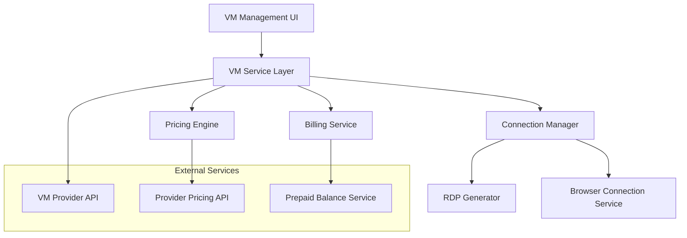

# Design Document: Virtual Machine Management

## Overview

The Virtual Machine Management system provides a streamlined interface for users to create, manage, and connect to virtual machines. The system integrates with backend VM providers, handles real-time pricing with markup calculations, manages prepaid balance deductions, and offers multiple connection methods including browser-based access and RDP file downloads.

## Architecture

The system follows a modular architecture with clear separation between UI components, business logic, and external integrations:



## Components and Interfaces

### VM Management Dashboard Component
- **Purpose**: Main interface for viewing and managing virtual machines
- **Key Features**: List view, search/filter, status indicators, action buttons
- **State Management**: VM list, filter states, loading states
- **Props Interface**:
  ```typescript
  interface VMDashboardProps {
    userId: string;
    onVMCreate: () => void;
    onVMConnect: (vmId: string, method: ConnectionMethod) => void;
    onVMDelete: (vmId: string) => void;
  }
  ```

### VM Creation Modal Component
- **Purpose**: Simplified VM configuration interface
- **Key Features**: Form validation, real-time pricing, configuration options
- **State Management**: Form data, pricing updates, validation errors
- **Props Interface**:
  ```typescript
  interface VMCreationProps {
    isOpen: boolean;
    onClose: () => void;
    onSubmit: (config: VMConfiguration) => Promise<void>;
    availableRegions: Region[];
    availableSizes: VMSize[];
  }
  ```

### VM Service Layer
- **Purpose**: Business logic for VM operations
- **Methods**:
  - `createVM(config: VMConfiguration): Promise<VM>`
  - `deleteVM(vmId: string): Promise<void>`
  - `getVMList(userId: string): Promise<VM[]>`
  - `getVMStatus(vmId: string): Promise<VMStatus>`
  - `generateConnection(vmId: string, method: ConnectionMethod): Promise<ConnectionInfo>`

### Pricing Engine
- **Purpose**: Calculate real-time pricing with markup
- **Methods**:
  - `calculatePrice(config: VMConfiguration): Promise<PriceInfo>`
  - `getProviderPrice(config: VMConfiguration): Promise<number>`
  - `applyMarkup(basePrice: number): number`

### Connection Manager
- **Purpose**: Handle VM connection methods
- **Methods**:
  - `generateRDPFile(vmId: string): Promise<Blob>`
  - `getBrowserConnectionURL(vmId: string): Promise<string>`
  - `validateConnection(vmId: string): Promise<boolean>`

## Data Models

### VM Configuration
```typescript
interface VMConfiguration {
  name: string;
  operatingSystem: {
    type: 'windows' | 'linux';
    version: string;
  };
  region: {
    country: string;
    code: string;
  };
  size: {
    cpu: number;
    ram: number; // GB
    storage: number; // GB
    displayName: string;
  };
}
```

### Virtual Machine
```typescript
interface VM {
  id: string;
  userId: string;
  name: string;
  configuration: VMConfiguration;
  status: 'creating' | 'running' | 'stopped' | 'error';
  createdAt: Date;
  lastConnected?: Date;
  monthlyPrice: number;
  providerInstanceId: string;
  connectionInfo: {
    ipAddress: string;
    rdpPort: number;
    browserURL?: string;
  };
}
```

### Price Information
```typescript
interface PriceInfo {
  hourlyRate: number;
  monthlyRate: number;
  providerRate: number;
  markup: number;
  currency: string;
}
```

### Connection Information
```typescript
interface ConnectionInfo {
  method: 'rdp' | 'browser';
  rdpFile?: Blob;
  browserURL?: string;
  credentials: {
    username: string;
    password: string;
  };
}
```

## Correctness Properties

*A property is a characteristic or behavior that should hold true across all valid executions of a system-essentially, a formal statement about what the system should do. Properties serve as the bridge between human-readable specifications and machine-verifiable correctness guarantees.*

### Property 1: VM Creation Form Validation
*For any* VM creation attempt, the system should validate all required fields are completed and sufficient prepaid balance exists before allowing creation, preventing creation and displaying specific error messages when validation fails.
**Validates: Requirements 1.5, 2.5, 8.2**

### Property 2: Real-time Pricing Accuracy
*For any* VM configuration change, the displayed price should update immediately and equal the provider's hourly rate multiplied by 730 hours, plus 20% markup, rounded to the nearest currency unit.
**Validates: Requirements 2.1, 2.2, 2.3, 2.4**

### Property 3: VM Display Consistency
*For any* VM in the user's list, the system should display name, operating system, size, country, status with correct color indicators (green for running, red for stopped), creation date, and action buttons.
**Validates: Requirements 3.2, 3.3, 3.4**

### Property 4: Search and Filter Functionality
*For any* search query or filter combination, the system should return only VMs that match all specified criteria and update the list in real-time as filters change.
**Validates: Requirements 5.2, 5.5**

### Property 5: Connection Method Reliability
*For any* running VM, the system should provide both browser-based and RDP connection options, with RDP files configured to auto-open on Windows and macOS, and browser connections opening in new tabs.
**Validates: Requirements 4.1, 4.2, 4.3, 4.4, 4.5**

### Property 6: VM Lifecycle Management
*For any* VM operation, creation should immediately charge the monthly amount and provision with selected configuration, while deletion should immediately terminate the instance, remove from dashboard, and stop billing.
**Validates: Requirements 6.1, 6.2, 6.3, 6.4, 8.1**

### Property 7: VM Persistence Guarantee
*For any* VM that has been created, all user installations, file saves, configuration changes, and customizations should persist across disconnection and reconnection sessions until the VM is explicitly deleted.
**Validates: Requirements 7.1, 7.2, 7.3, 7.4**

### Property 8: Billing Integration Accuracy
*For any* VM transaction, the system should track hourly usage for provider reconciliation and maintain complete billing records for all VM-related charges and balance deductions.
**Validates: Requirements 8.3, 8.4**

## Error Handling

### VM Creation Errors
- **Insufficient Balance**: Display required amount and link to balance top-up
- **Provider API Failure**: Retry mechanism with exponential backoff
- **Invalid Configuration**: Client-side validation with clear error messages
- **Network Timeout**: Graceful degradation with status updates

### Connection Errors
- **VM Not Running**: Display status and option to start VM
- **RDP Generation Failure**: Fallback to browser connection
- **Browser Connection Unavailable**: Fallback to RDP download
- **Authentication Failure**: Regenerate credentials and retry

### Billing Errors
- **Balance Deduction Failure**: Rollback VM creation and notify user
- **Pricing API Unavailable**: Use cached rates with warning message
- **Currency Conversion Issues**: Default to USD with notification

## Testing Strategy

### Unit Testing
- VM configuration validation logic
- Pricing calculation accuracy
- RDP file generation format
- Search and filter algorithms
- Balance validation rules

### Property-Based Testing
The system will use **fast-check** library for property-based testing with minimum 100 iterations per test:

- **Property 1 Test**: Generate random VM configurations and verify billing consistency
- **Property 2 Test**: Generate random configuration changes and verify pricing accuracy
- **Property 3 Test**: Generate random VM states and verify status display consistency
- **Property 4 Test**: Generate random search terms and filters, verify result accuracy
- **Property 5 Test**: Generate random VM instances and verify connection method reliability
- **Property 6 Test**: Generate random user actions and verify persistence across sessions
- **Property 7 Test**: Generate random balance scenarios and verify validation behavior
- **Property 8 Test**: Generate random deletion operations and verify cleanup integrity

### Integration Testing
- End-to-end VM creation workflow
- Provider API integration reliability
- Billing system integration accuracy
- Connection method cross-platform compatibility

### Performance Testing
- Dashboard loading with large VM lists
- Real-time pricing update responsiveness
- Concurrent VM creation handling
- Connection establishment latency

Each property-based test will be tagged with: **Feature: virtual-machine-management, Property {number}: {property_text}**